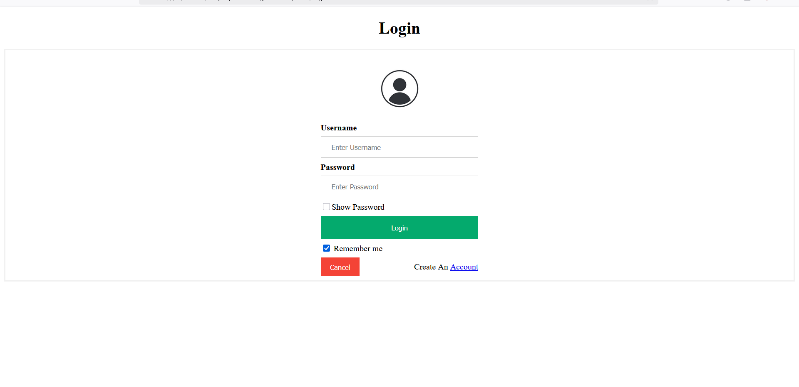

# Employee-Management-System
This is an employee management system written in PHP, with MySQL used as the dbms.
The employees can create account,login with credentials and see their salary and other information.The admins can change salary of the users and even delete entry from the table.
This was written 3 years ago. It requires a mysql server setup.

# Setup a MySQL server first

connection.php contains the credentials that are required to connect to the mysql server. 

Populate the table with data. This will work.

